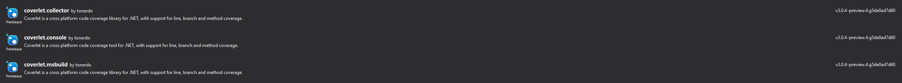

# Consume nightly build

To consume nightly builds, create a `NuGet.Config` in your root solution directory and add the following content:

```xml
<?xml version="1.0" encoding="utf-8"?>
<configuration>
  <packageSources>
    <clear />
    <!-- Coverlet nightly build feed -->
    <add key="coverletNightly" value="https://pkgs.dev.azure.com/tonerdo/coverlet/_packaging/coverlet-nightly/nuget/v3/index.json" /> 
    <!-- Default nuget feed -->
    <add key="nuget" value="https://api.nuget.org/v3/index.json" /> 
    <!-- Add all other needed feed -->
  </packageSources>
</configuration>
```

## Install packages

### Visual Studio:

\
Example:\


### NuGet (Package Manager console):
```powershell
PM> Install-Package coverlet.msbuild -Version X.X.X-preview.X.XXX -Source https://pkgs.dev.azure.com/tonerdo/coverlet/_packaging/coverlet-nightly/nuget/v3/index.json
```
Example:
```powershell
PM> Install-Package coverlet.msbuild -Version 3.0.4-preview.4.g5de0ad7d60 -Source https://pkgs.dev.azure.com/tonerdo/coverlet/_packaging/coverlet-nightly/nuget/v3/index.json
```

### .NET CLI:
```bash
 dotnet add package coverlet.msbuild --version X.X.X-preview.X.XXX --source https://pkgs.dev.azure.com/tonerdo/coverlet/_packaging/coverlet-nightly/nuget/v3/index.json
```
Example:
```bash
 dotnet add package coverlet.msbuild --version 3.0.4-preview.4.g5de0ad7d60 --source https://pkgs.dev.azure.com/tonerdo/coverlet/_packaging/coverlet-nightly/nuget/v3/index.json
```

### MSBuild project file:

```xml
<PackageReference Include="coverlet.msbuild" Version="X.X.X-preview.X.XXX " />
```
Example:
```xml
<PackageReference Include="coverlet.msbuild" Version="3.0.4-preview.4.g5de0ad7d60" />
```