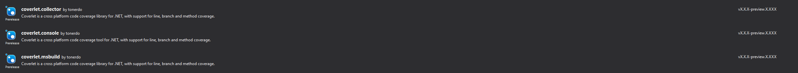
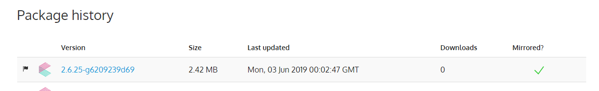
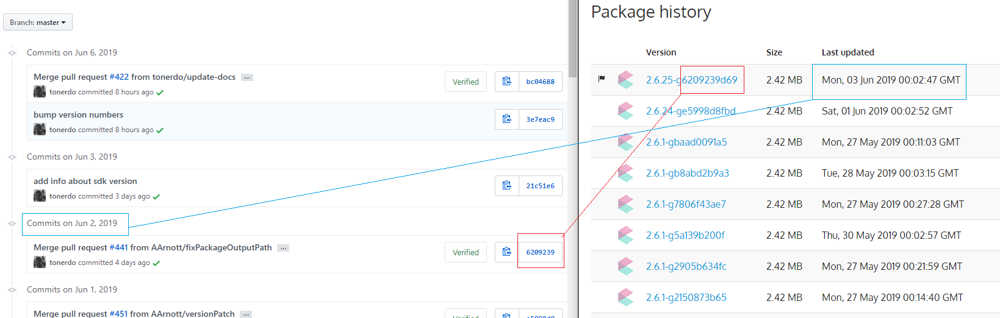

# Consume nightly build

You can check metadata of nightly build packages here:

Msbuild https://www.myget.org/feed/coverlet-dev/package/nuget/coverlet.msbuild  
VSTest collector https://www.myget.org/feed/coverlet-dev/package/nuget/coverlet.collector  
.Net tools https://www.myget.org/feed/coverlet-dev/package/nuget/coverlet.console  

To consume nightly build create a `NuGet.Config` on your root solution directory and add following content
```xml
<?xml version="1.0" encoding="utf-8"?>
<configuration>
  <packageSources>
    <clear />
    <!-- Coverlet nightly build feed -->
    <add key="coverletNightly" value="https://www.myget.org/F/coverlet-dev/api/v3/index.json" /> 
    <!-- Defaul nuget feed -->
    <add key="nuget" value="https://api.nuget.org/v3/index.json" /> 
    <!-- Add all other needed feed -->
  </packageSources>
</configuration>
```

### Install packages

You can install nightly package using visual studio



Nuget(PM console)
```
PM> Install-Package coverlet.msbuild -Version 2.6.25-g6209239d69 -Source https://www.myget.org/F/coverlet-dev/api/v3/index.json
```

.NET CLI
```
 dotnet add package coverlet.msbuild --version 2.6.25-g6209239d69 --source https://www.myget.org/F/coverlet-dev/api/v3/index.json
```

.csproj

```
<PackageReference Include="coverlet.msbuild" Version="2.6.25-g6209239d69" />
```

### How to verify version

You can understand which version you're using comparing nightly build release date and repo commits.  
For instance if we want to consume last msbuild nightly build:
* Go to https://www.myget.org/feed/coverlet-dev/package/nuget/coverlet.msbuild
* Scroll down the page and check release date 

* Go to repo commits and compare date and first part of commit hash


As you can see we build at 00.00 UTC and build takes some seconds, so it's possible that release date won't be the same of commit repo.