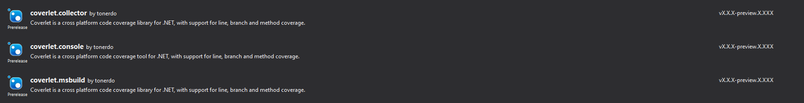

# Consume nightly build

You can check the metadata of nightly build packages here:

MSBuild https://www.myget.org/feed/coverlet-dev/package/nuget/coverlet.msbuild  
VSTest collector https://www.myget.org/feed/coverlet-dev/package/nuget/coverlet.collector  
.NET tools https://www.myget.org/feed/coverlet-dev/package/nuget/coverlet.console  

To consume nightly builds, create a `NuGet.Config` in your root solution directory and add the following content:

```xml
<?xml version="1.0" encoding="utf-8"?>
<configuration>
  <packageSources>
    <clear />
    <!-- Coverlet nightly build feed -->
    <add key="coverletNightly" value="https://www.myget.org/F/coverlet-dev/api/v3/index.json" /> 
    <!-- Default nuget feed -->
    <add key="nuget" value="https://api.nuget.org/v3/index.json" /> 
    <!-- Add all other needed feed -->
  </packageSources>
</configuration>
```

### Install packages

Visual Studio:



NuGet (Package Manager console):

```powershell
PM> Install-Package coverlet.msbuild -Version 2.6.25-g6209239d69 -Source https://www.myget.org/F/coverlet-dev/api/v3/index.json
```

.NET CLI:

```bash
 dotnet add package coverlet.msbuild --version 2.6.25-g6209239d69 --source https://www.myget.org/F/coverlet-dev/api/v3/index.json
```

MSBuild project file:

```xml
<PackageReference Include="coverlet.msbuild" Version="2.6.25-g6209239d69" />
```

### How to verify version

You can understand which version you're using by comparing nightly build release date with repo commits.  

For instance if we want to consume last msbuild nightly build:

* Go to https://www.myget.org/feed/coverlet-dev/package/nuget/coverlet.msbuild
* Scroll down the page and check release date 

* Go to repo commits and compare date and first part of commit hash


As you can see we build at 00.00 UTC and build takes some seconds, so it's possible that release date won't be the same as repo commits.
