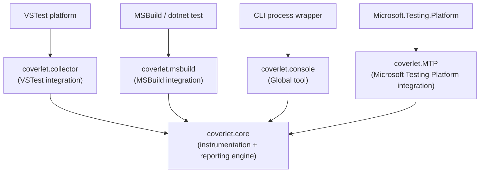
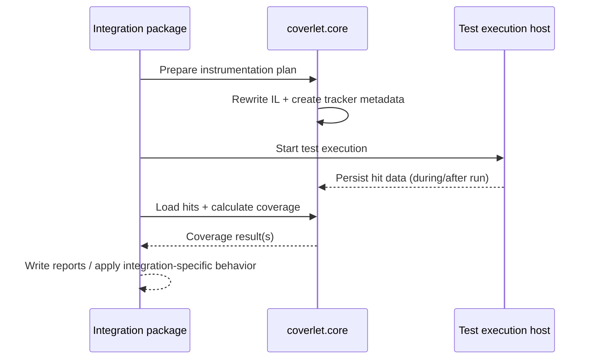

# Coverlet Architecture Overview

This document summarizes dependencies, responsibilities, and constraints for the main Coverlet packages:

- `coverlet.core`
- `coverlet.collector`
- `coverlet.msbuild`
- `coverlet.console`
- `coverlet.MTP`

## Package dependency map

## Responsibilities and constraints by package

| Package | Primary dependencies | Main functionality | Key limitations / constraints |
| :-- | :-- | :-- | :-- |
| `coverlet.core` | `Mono.Cecil`, globbing and reporting dependencies | Assembly instrumentation, hit tracking, filtering, line/branch/method coverage aggregation, multi-format report generation | Must operate on assemblies with symbols/PDBs; instrumentation modifies binaries during run; source resolution affects report quality |
| `coverlet.collector` | `coverlet.core`, VSTest Data Collector APIs | Hooks VSTest collector lifecycle, instruments before test execution, collects hits, emits attachments | Controlled by VSTest lifecycle and output layout (`TestResults/<guid>`); narrower feature set than msbuild/console in some scenarios |
| `coverlet.msbuild` | `coverlet.core`, MSBuild task APIs | Integrates through targets/tasks before and after tests, report generation, threshold enforcement, merge support | Sensitive to target ordering and command-line escaping; rebuilds between instrumentation and execution can invalidate coverage |
| `coverlet.console` | `coverlet.core`, `System.CommandLine` | Standalone orchestration around an external target command/process; instrumentation and report output | Requires no-rebuild execution flow; relies on graceful process shutdown for complete hit flushing |
| `coverlet.MTP` | `coverlet.core`, `Microsoft.Testing.Platform`, configuration stack | Extends MTP runner, instruments assemblies, exchanges state via environment/process lifecycle, generates reports | Architecture is tightly bound to MTP extension model and process lifecycle; current feature set has documented gaps (for example threshold/merge in current docs) |

## Integration execution pattern

