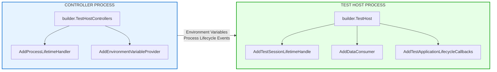
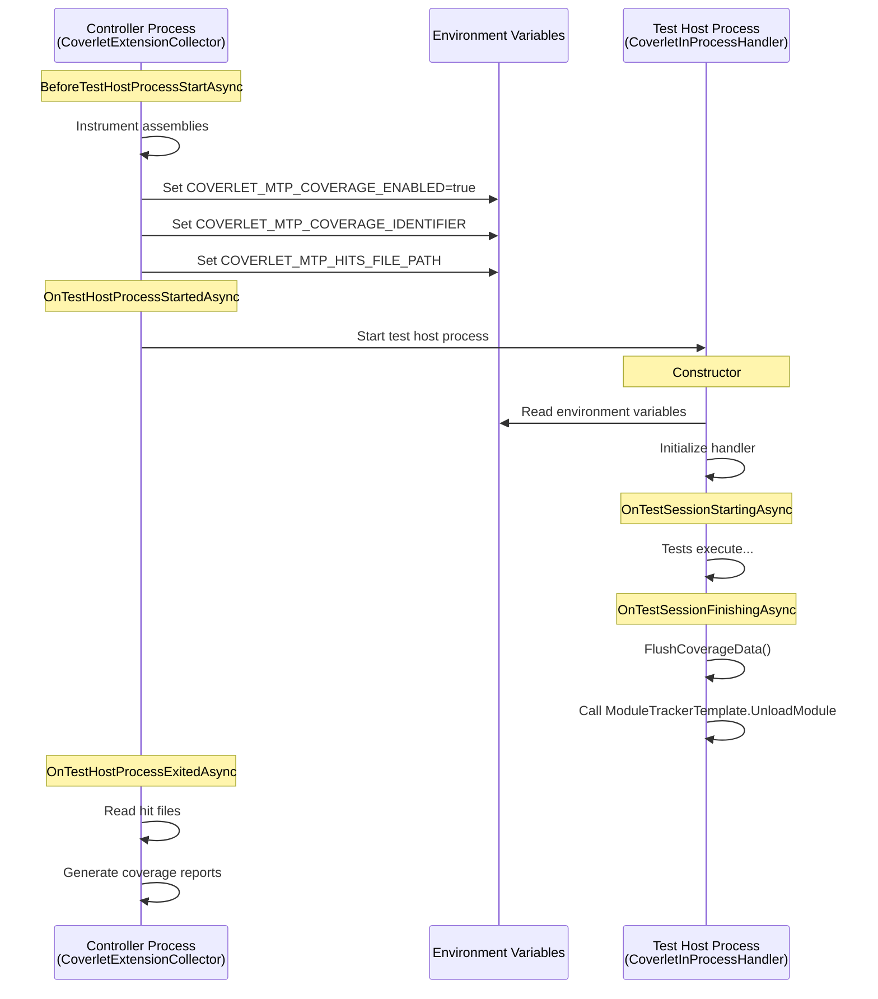

# Coverlet Microsoft Testing Platform Integration

[Microsoft.Testing.Platform and Microsoft Test Framework](https://github.com/microsoft/testfx) is a lightweight alternative for VSTest.

More information is available here:

- [Microsoft.Testing.Platform overview](https://learn.microsoft.com/en-us/dotnet/core/testing/microsoft-testing-platform-intro?tabs=dotnetcli)
- [Microsoft.Testing.Platform extensibility](https://learn.microsoft.com/en-us/dotnet/core/testing/microsoft-testing-platform-architecture-extensions)

coverlet.MTP implements coverlet.collector functionality for Microsoft.Testing.Platform.

## Supported Runtime Versions

Since version `8.0.0`:

- .NET Core >= 8.0

## Quick Start

### Installation

Add the `coverlet.MTP` package to your test project:

```bash
dotnet add package coverlet.MTP
```

ToDo: Usage details

A sample project file looks like:

```xml
<Project Sdk="Microsoft.NET.Sdk">
   <PropertyGroup>
      <TargetFramework>net8.0</TargetFramework>
      <OutputType>Exe</OutputType>
      <!-- Enable Microsoft Testing Platform -->
      <UseMicrosoftTestingPlatformRunner>true</UseMicrosoftTestingPlatformRunner>
      <TestingPlatformDotnetTestSupport>true</TestingPlatformDotnetTestSupport> <!-- not required for .NET SDK 10 or later -->
   </PropertyGroup>
      <ItemGroup>
      <!-- Use xunit.v3.mtp-v2 for MTP v2.x compatibility -->
      <PackageReference Include="xunit.v3.mtp-v2" Version="3.2.1" />
      <PackageReference Include="Microsoft.Testing.Platform" Version="2.0.2" />
      <PackageReference Include="coverlet.MTP" Version="8.0.0" />
   </ItemGroup>
</Project>
```

### Basic Usage

To collect code coverage, run your test executable with the `--coverlet` flag:

```bash
dotnet exec <test-assembly.dll> --coverlet
```

Or using `dotnet test` with MTP enabled projects:

```bash
dotnet test --coverlet
```

After the test run, a `coverage.json` file containing the results will be generated in the current directory.

## Command Line Options

The `coverlet.MTP` extension provides the following command line options. To see all available options, run:

```bash
dotnet exec <test-assembly.dll> --help
```

### Coverage Options

| Option | Description |
| :------- | :------------ |
| `--coverlet` | Enable code coverage data collection. |
| `--coverlet-output-format <format>` | Output format(s) for coverage report. Supported formats: `json`, `lcov`, `opencover`, `cobertura`, `teamcity`. Can be specified multiple times. |
| `--coverlet-include <filter>` | Include assemblies matching filters (e.g., `[Assembly]Type`). Can be specified multiple times. |
| `--coverlet-include-directory <path>` | Include additional directories for instrumentation. Can be specified multiple times. |
| `--coverlet-exclude <filter>` | Exclude assemblies matching filters (e.g., `[Assembly]Type`). Can be specified multiple times. |
| `--coverlet-exclude-by-file <pattern>` | Exclude source files matching glob patterns. Can be specified multiple times. |
| `--coverlet-exclude-by-attribute <attribute>` | Exclude methods/classes decorated with attributes. Can be specified multiple times. |
| `--coverlet-include-test-assembly` | Include test assembly in coverage. |
| `--coverlet-single-hit` | Limit the number of hits to one for each location. |
| `--coverlet-skip-auto-props` | Skip auto-implemented properties. |
| `--coverlet-does-not-return-attribute <attribute>` | Attributes that mark methods as not returning. Can be specified multiple times. |
| `--coverlet-exclude-assemblies-without-sources <value>` | Exclude assemblies without source code. Values: `MissingAll`, `MissingAny`, `None`. |

### Examples

**Generate coverage in JSON format (default):**

```bash
dotnet exec TestProject.dll --coverlet
```

**Generate coverage in Cobertura format:**

```bash
dotnet exec TestProject.dll --coverlet --coverlet-output-format cobertura
```

**Generate coverage in multiple formats:**

```bash
dotnet run TestProject.dll --coverlet --coverlet-output-format json --coverlet-output-format cobertura --coverlet-output-format lcov
```

**Include only specific assemblies:**

```bash
dotnet exec TestProject.dll --coverlet --coverlet-include "[MyApp.]"
```

**Exclude test assemblies and specific namespaces:**

```bash
dotnet exec TestProject.dll --coverlet --coverlet-exclude "[.Tests]" --coverlet-exclude "[]MyApp.Generated."
```

**Exclude by attribute:**

```bash
dotnet exec TestProject.dll --coverlet --coverlet-exclude-by-attribute "Obsolete" --coverlet-exclude-by-attribute "GeneratedCode"
```

## Coverage Output

Coverlet can generate coverage results in multiple formats:

- `json` (default) - Coverlet's native JSON format
- `lcov` - LCOV format
- `opencover` - OpenCover XML format
- `cobertura` - Cobertura XML format
- `teamcity` - TeamCity service messages

## Filter Expressions

Filter expressions allow fine-grained control over what gets included or excluded from coverage.

**Syntax:** `[Assembly-Filter]Type-Filter`

**Wildcards:**

- `*` matches zero or more characters
- `?` makes the prefixed character optional

**Examples:**

- `[*]*` - All types in all assemblies
- `[coverlet.*]Coverlet.Core.Coverage` - Specific class in matching assemblies
- `[*]Coverlet.Core.Instrumentation.*` - All types in a namespace
- `[coverlet.*.tests?]*` - Assemblies ending with `.test` or `.tests`

Both `--coverlet-include` and `--coverlet-exclude` can be used together, but `--coverlet-exclude` takes precedence.

## Excluding From Coverage

### Using Attributes

Apply the `ExcludeFromCodeCoverage` attribute from `System.Diagnostics.CodeAnalysis` to exclude methods or classes:

```csharp
[ExcludeFromCodeCoverage] public class NotCovered { // This class will be excluded from coverage }
```

Additional attributes can be specified using `--coverlet-exclude-by-attribute`.

### Using Source File Patterns

Exclude source files using glob patterns with `--coverlet-exclude-by-file`:

```bash
dotnet exec TestProject.dll --coverlet --coverlet-exclude-by-file "**/Generated/*.cs"
```

## How It Works

The `coverlet.MTP` extension integrates with the Microsoft Testing Platform using the extensibility model:

1. **Test Host Controller Extension**: Implements `ITestHostProcessLifetimeHandler` to instrument assemblies before tests run and collect coverage after tests complete.

2. **Before Tests Run**:
   - Locates the test assembly and referenced assemblies with PDBs
   - Instruments assemblies by inserting code to record sequence point hits

3. **After Tests Run**:
   - Restores original non-instrumented assemblies
   - Reads recorded hit information
   - Generates coverage report in the specified format(s)

## Comparison with coverlet.collector (VSTest)

| Feature | coverlet.MTP | coverlet.collector |
| :-------- | :------------- | :------------------- |
| Test Platform | Microsoft Testing Platform | VSTest |
| Configuration | Command line options | runsettings file |
| | coverlet.mtp.appsettings.json | |
| Default Format | JSON | Cobertura |

## Known Limitations

- Threshold validation is not yet supported (planned for future releases)
- Report merging is not yet supported (use external tools like `dotnet-coverage` or `reportgenerator`)

> [!TIP]
> **Merging coverage files from multiple test runs:**
>
> Use `dotnet-coverage` tool:
>
> ```bash
> dotnet-coverage merge coverage/**/coverage.cobertura.xml -f cobertura -o coverage/merged.xml
> ```
>
> Or use `reportgenerator`:
>
> ```bash
> reportgenerator -reports:"**/*.cobertura.xml" -targetdir:"coverage/report" -reporttypes:"HtmlInline_AzurePipelines_Dark;Cobertura"
> ```

## Architecture

Coverlet.MTP uses a two-process architecture:



And here's a sequence diagram showing the coverlet.MTP flow:



### Environment Variables

| Variable | Purpose |
| -------- | ------- |
| `COVERLET_MTP_COVERAGE_ENABLED` | Indicates coverage is active |
| `COVERLET_MTP_COVERAGE_IDENTIFIER` | Unique ID for result correlation |
| `COVERLET_MTP_HITS_FILE_PATH` | Directory for hit data files |
| `COVERLET_MTP_INPROC_DEBUG` | Set to "1" to debug in-process handler |
| `COVERLET_MTP_INPROC_EXCEPTIONLOG_ENABLED` | Set to "1" for detailed error logging |

## Troubleshooting

### Enable Diagnostic Output

Use the MTP diagnostic options to get detailed logs:

```bash
dotnet exec TestProject.dll --coverlet --diagnostic --diagnostic-verbosity trace --diagnostic-output-directory ./logs
```

### Debug Coverlet Extension

Set the environment variable to attach a debugger:

```bash
set COVERLET_MTP_DEBUG=1 dotnet exec TestProject.dll --coverlet
```

## Debugging and Troubleshooting (*not tested - just defined*)

### Enable Debugger Launch

To launch a debugger when coverlet.MTP initializes:

Windows:

```shell
set COVERLET_MTP_DEBUG=1
```

Linux/macOS:

```shell
export COVERLET_MTP_DEBUG=1
```

### Wait for Debugger Attach

To make coverlet.MTP wait for a debugger to attach (Windows):

```shell
set COVERLET_MTP_DEBUG_WAIT=1
```

The extension will display:

```[Coverlet.MTP] CoverletExtension: Waiting for debugger to attach... [Coverlet.MTP] Process Id: 12345, Name: dotnet```

Use Visual Studio's "Debug > Attach to Process" (Ctrl+Alt+P) to attach.

### Enable Tracker Logging

To collect detailed logs from the injected coverage tracker (Windows):

```shell
set COVERLET_ENABLETRACKERLOG=1
```

Log files will be created near the instrumented module location:

- `moduleName.dll_tracker.txt` - Main tracker log
- `TrackersHitsLog/` folder - Detailed hit information

### Enable Instrumentation Debugging

For detailed instrumentation diagnostics (Windows):

```shell
set COVERLET_MTP_INSTRUMENTATION_DEBUG=1
```

### Enable Exception Logging

To capture detailed exception information (Windows):

```shell
set COVERLET_MTP_EXCEPTIONLOG_ENABLED=1
```

### Using MTP Built-in Diagnostics

Microsoft Testing Platform provides built-in diagnostic logging (Windows):

```shell
dotnet test --diagnostic --diagnostic-verbosity Trace
```

This creates detailed logs in the `TestResults` directory.

### Combined Debugging Example

Enable all debugging features (Windows)

```shell
set COVERLET_MTP_DEBUG_WAIT=1 set COVERLET_ENABLETRACKERLOG=1 set COVERLET_MTP_EXCEPTIONLOG_ENABLED=1
```

Run tests with MTP diagnostics

```shell
dotnet test --coverlet --diagnostic --diagnostic-verbosity Trace
```

## Requirements

- .NET 8.0 SDK or newer
- Microsoft.Testing.Platform 2.0.0 or newer
- Test framework with MTP support (e.g., xUnit v3 (xunit.v3.mtp-v2), MSTest v3, NUnit with MTP adapter)

## Related Documentation

- [VSTest Integration](VSTestIntegration.md) - For VSTest-based projects using `coverlet.collector`
- [MSBuild Integration](MSBuildIntegration.md) - For MSBuild-based coverage collection
- [Global Tool](GlobalTool.md) - For standalone coverage collection
- [Known Issues](KnownIssues.md) - Common issues and workarounds
