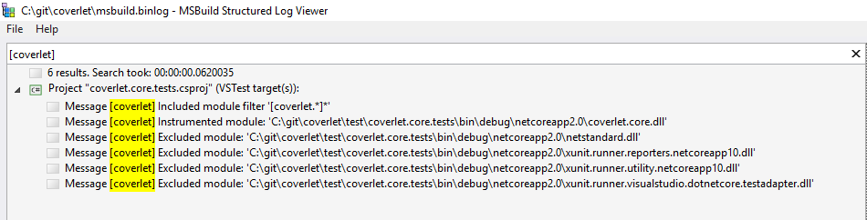

# Troubleshooting

## MSBuild integration

1) Generate verbose log

```
dotnet test test\coverlet.core.tests\coverlet.core.tests.csproj -c debug /p:CollectCoverage=true /p:CoverletOutputFormat=opencover /p:Include=[coverlet.*]* -verbosity:diagnostic -bl:msbuild.binlog -noconsolelogger
```

2) Download http://msbuildlog.com/
3) Open `msbuild.binlog` generated and search for '[coverlet]' logs
 


## Collectors integration

```
dotnet test --collect:"XPlat Code Coverage" --settings runsettings --diag:log.txt
```

You'll get logs file in same folder similar to

```
log.datacollector.19-09-12_14-55-17_64755_5.txt
log.host.19-09-12_14-55-18_82700_6.txt
log.txt
```
Search inside with filter '[coverlet]'

## Coverlet Global Tool

```
coverlet "C:\git\coverlet\test\coverlet.core.tests\bin\Debug\netcoreapp2.0\coverlet.core.tests.dll" --target "dotnet" --targetargs "test C:\git\coverlet\test\coverlet.core.tests --no-build" --verbosity detailed
```

Sample output

```
...
Instrumented module: 'C:\git\coverlet\test\coverlet.core.tests\bin\Debug\netcoreapp2.0\coverlet.core.dll'
Instrumented module: 'C:\git\coverlet\test\coverlet.core.tests\bin\Debug\netcoreapp2.0\xunit.runner.reporters.netcoreapp10.dll'
Instrumented module: 'C:\git\coverlet\test\coverlet.core.tests\bin\Debug\netcoreapp2.0\xunit.runner.utility.netcoreapp10.dll'
Instrumented module: 'C:\git\coverlet\test\coverlet.core.tests\bin\Debug\netcoreapp2.0\xunit.runner.visualstudio.dotnetcore.testadapter.dll'
Test run for C:\git\coverlet\test\coverlet.core.tests\bin\Debug\netcoreapp2.0\coverlet.core.tests.dll(.NETCoreApp,Version=v2.0)
Microsoft (R) Test Execution Command Line Tool Version 16.0.1
Copyright (c) Microsoft Corporation.  All rights reserved.
Starting test execution, please wait...
[xUnit.net 00:00:01.4218329]     Coverlet.Core.Tests.Instrumentation.ModuleTrackerTemplateTests.HitsOnMultipleThreadsCorrectlyCounted [SKIP]
Skipped  Coverlet.Core.Tests.Instrumentation.ModuleTrackerTemplateTests.HitsOnMultipleThreadsCorrectlyCounted
[xUnit.net 00:00:03.6302618]     Coverlet.Core.Instrumentation.Tests.InstrumenterTests.TestCoreLibInstrumentation [SKIP]
Skipped  Coverlet.Core.Instrumentation.Tests.InstrumenterTests.TestCoreLibInstrumentation
Total tests: 113. Passed: 111. Failed: 0. Skipped: 2.
Test Run Successful.
Test execution time: 4,6411 Seconds

Calculating coverage result...
Hits file:'C:\Users\Marco\AppData\Local\Temp\coverlet.core_703263e9-21f0-4d1c-9ce3-98ddeacecc01' not found for module: 'coverlet.core'
  Generating report 'C:\git\coverlet\src\coverlet.console\bin\Debug\netcoreapp2.2\coverage.json'
+--------------------------------------------------+--------+--------+--------+
| Module                                           | Line   | Branch | Method |
+--------------------------------------------------+--------+--------+--------+
| coverlet.core                                    | 0%     | 0%     | 0%     |
+--------------------------------------------------+--------+--------+--------+
| xunit.runner.reporters.netcoreapp10              | 2,11%  | 0,83%  | 8,88%  |
+--------------------------------------------------+--------+--------+--------+
| xunit.runner.utility.netcoreapp10                | 12,06% | 6,6%   | 17,09% |
+--------------------------------------------------+--------+--------+--------+
| xunit.runner.visualstudio.dotnetcore.testadapter | 50,04% | 42,08% | 50,9%  |
+--------------------------------------------------+--------+--------+--------+

+---------+--------+--------+--------+
|         | Line   | Branch | Method |
+---------+--------+--------+--------+
| Total   | 17,76% | 13,82% | 22,64% |
+---------+--------+--------+--------+
| Average | 4,44%  | 3,455% | 5,66%  |
+---------+--------+--------+--------+
```

## Use local build (no collectors)

Sometimes is useful test local updated source to fix issue.  
You can "load" your local build using simple switch:

* build repo

```
D:\git\coverlet (fixjsonserializerbug -> origin)
λ dotnet build
Microsoft (R) Build Engine version 16.1.76+g14b0a930a7 for .NET Core
Copyright (C) Microsoft Corporation. All rights reserved.

  Restore completed in 52.23 ms for D:\git\coverlet\test\coverlet.testsubject\coverlet.testsubject.csproj.
  Restore completed in 58.97 ms for D:\git\coverlet\src\coverlet.console\coverlet.console.csproj.
  Restore completed in 59 ms for D:\git\coverlet\src\coverlet.core\coverlet.core.csproj.
  Restore completed in 59.17 ms for D:\git\coverlet\src\coverlet.msbuild.tasks\coverlet.msbuild.tasks.csproj.
  Restore completed in 59.26 ms for D:\git\coverlet\src\coverlet.collector\coverlet.collector.csproj.
  Restore completed in 60.1 ms for D:\git\coverlet\test\coverlet.collector.tests\coverlet.collector.tests.csproj.
  Restore completed in 60.42 ms for D:\git\coverlet\test\coverlet.core.performancetest\coverlet.core.performancetest.csproj.
  Restore completed in 60.47 ms for D:\git\coverlet\test\coverlet.core.tests\coverlet.core.tests.csproj.
  Restore completed in 22.85 ms for D:\git\coverlet\test\coverlet.core.tests\coverlet.core.tests.csproj.
  coverlet.testsubject -> D:\git\coverlet\test\coverlet.testsubject\bin\Debug\netcoreapp2.0\coverlet.testsubject.dll
  coverlet.core -> D:\git\coverlet\src\coverlet.core\bin\Debug\netstandard2.0\coverlet.core.dll
  coverlet.msbuild.tasks -> D:\git\coverlet\src\coverlet.msbuild.tasks\bin\Debug\netstandard2.0\coverlet.msbuild.tasks.dll
  coverlet.collector -> D:\git\coverlet\src\coverlet.collector\bin\Debug\netcoreapp2.0\coverlet.collector.dll
  coverlet.console -> D:\git\coverlet\src\coverlet.console\bin\Debug\netcoreapp2.2\coverlet.console.dll
  coverlet.core.performancetest -> D:\git\coverlet\test\coverlet.core.performancetest\bin\Debug\netcoreapp2.0\coverlet.core.performancetest.dll
  coverlet.core.tests -> D:\git\coverlet\test\coverlet.core.tests\bin\Debug\netcoreapp2.0\coverlet.core.tests.dll
  coverlet.collector.tests -> D:\git\coverlet\test\coverlet.collector.tests\bin\Debug\netcoreapp2.2\coverlet.collector.tests.dll

Build succeeded.
    0 Warning(s)
    0 Error(s)

Time Elapsed 00:00:07.42

D:\git\coverlet (fixjsonserializerbug -> origin)
```

* Go to repro project and run

```
D:\git\Cake.Codecov\Source\Cake.Codecov.Tests (develop -> origin)
λ dotnet test /p:CollectCoverage=true /p:Exclude="[xunit.*]*" /p:CoverletToolsPath=D:\git\coverlet\src\coverlet.msbuild.tasks\bin\Debug\netstandard2.0\  
Test run for D:\git\Cake.Codecov\Source\Cake.Codecov.Tests\bin\Debug\netcoreapp2.0\Cake.Codecov.Tests.dll(.NETCoreApp,Version=v2.0)
...
```

In this way you can add `Debug.Launch()` inside coverlet source and debug.

## Use local collectors build 

To use/debug local collectors build we need to tell to our project to restore and use our local build nuget package.

1) Build local package

```
C:\git\coverlet\src\coverlet.collector (master -> origin)
λ dotnet pack
Microsoft (R) Build Engine version 16.2.32702+c4012a063 for .NET Core
Copyright (C) Microsoft Corporation. All rights reserved.

  Restore completed in 50,28 ms for C:\git\coverlet\src\coverlet.collector\coverlet.collector.csproj.
  Restore completed in 50,28 ms for C:\git\coverlet\src\coverlet.core\coverlet.core.csproj.
  coverlet.core -> C:\git\coverlet\src\coverlet.core\bin\Debug\netstandard2.0\coverlet.core.dll
  coverlet.collector -> C:\git\coverlet\src\coverlet.collector\bin\Debug\netcoreapp2.0\coverlet.collector.dll
  Successfully created package 'C:\git\coverlet\bin\Debug\Packages\coverlet.collector.1.0.67.nupkg'.
  Successfully created package 'C:\git\coverlet\bin\Debug\Packages\coverlet.collector.1.0.67.snupkg'.
```
2) Add new `NuGet.Config` file on your test project/solution
```
<?xml version="1.0" encoding="utf-8"?>
<configuration>
  <packageSources>
    <clear />
    <!-- Local path where you build packages -->
    <add key="localpackagesbuild" value="C:\git\coverlet\bin\Debug\Packages" /> 
    <!-- Defaul nuget feed -->
    <add key="nuget" value="https://api.nuget.org/v3/index.json" /> 
    <!-- Add all other needed feed -->
  </packageSources>
</configuration>
```
3) Update nuget package in our test project
```xml
<Project Sdk="Microsoft.NET.Sdk">

  <PropertyGroup>
    <TargetFramework>netcoreapp2.2</TargetFramework>
    <IsPackable>false</IsPackable>
  </PropertyGroup>

  <ItemGroup>
    <PackageReference Include="Microsoft.NET.Test.Sdk" Version="16.2.0" />
    <PackageReference Include="xunit" Version="2.4.0" />
    <PackageReference Include="xunit.runner.visualstudio" Version="2.4.0" />
    <PackageReference Include="coverlet.collector" Version="1.0.67" /> <-- My local package version
  </ItemGroup>

  <ItemGroup>
    <ProjectReference Include="..\ClassLibrary1\ClassLibrary1.csproj" />
  </ItemGroup>

</Project>
```

4) Run test command

```
 dotnet test XUnitTestProject1\ --collect:"XPlat Code Coverage"
```

You can also attach/debug your code adding some line of code on collectors i.e.

Attach using vs "Attach to Process"

```csharp
while(!System.Diagnostics.Debugger.IsAttached)
{
    System.Threading.Thread.Sleep(1000);
}
```

Fire attach

```csharp
System.Diagnostics.Debugger.Launch();
```

If you want debug in-process collector, you need to set VSTEST_HOST_DEBUG(https://github.com/microsoft/vstest/issues/2158) environment variable

```
set VSTEST_HOST_DEBUG=1
```

Test host will wait for debugger

```
Starting test execution, please wait...
Logging Vstest Diagnostics in file: C:\git\coverletissue\collectorlog\XUnitTestProject1\log.txt
Host debugging is enabled. Please attach debugger to testhost process to continue.
Process Id: 800, Name: dotnet
```

**Every time you update code and rebuild new package, remember to remove local nuget cache (`RMDIR "C:\Users\[winUser]\.nuget\packages\coverlet.collector" /S /Q`) otherwise you'll load old collector code because the package version wasn't changed**

## Enable injected tracker log

Coverlet works thanks to ModuleTracker that is injected during instrumentation for every covered module. This piece of code is run as a part of tests and doesn't have any connection with Coverlet.

We can collect logs from trackers through an enviroment variable

```
 set COVERLET_ENABLETRACKERLOG=1
```

When enabled, tracking event will be collected in a log file near to module location. File name will be something like `moduleName.dll_tracker.txt` and files with detailed hits will be in a folder named `TrackersHitsLog`.

## Enable msbuild task instrumentation debugging

You can live attach and debug msbuild tasks with `COVERLET_MSBUILD_INSTRUMENTATIONTASK_DEBUG` env variable

```
 set COVERLET_MSBUILD_INSTRUMENTATIONTASK_DEBUG=1
```

You'll get this message during test run

```
dotnet test  -p:Include="[test_coverage.]"   -p:Exclude="[*.Test.*]*"   -p:CollectCoverage=true   -p:CoverletOutputFormat=cobertura   -p:CoverletOutput=coverage.cobertura.xml
Coverlet msbuild instrumentation task debugging is enabled. Please attach debugger to process to continue
Process Id: 29228 Name: dotnet
```

## Enable collector instrumentation debugging

You can live attach and debug collectors with `COVERLET_DATACOLLECTOR_OUTOFPROC_DEBUG` and `COVERLET_DATACOLLECTOR_INPROC_DEBUG` env variable

```
 set COVERLET_DATACOLLECTOR_OUTOFPROC_DEBUG=1
 set COVERLET_DATACOLLECTOR_INPROC_DEBUG=1
```

You will be asked to attach a debugger through UI popup.  
To enable exceptions log for in-process data collectors

```
 set COVERLET_DATACOLLECTOR_INPROC_EXCEPTIONLOG_ENABLED=1
```
